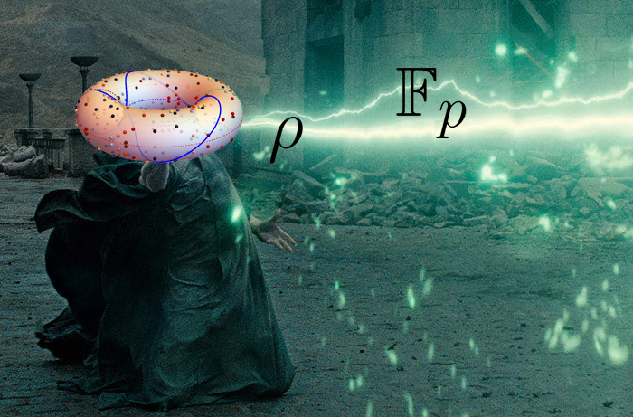

# Elliptic curve cryptography stuff



There will be some interesting things about elliptic curves: tasks and theory.

See the progress at [TODO](./TODO.md)

!!! note
    All tasks generators require [SageMath](http://www.sagemath.org/) to be installed.  
    The most easiest way to install SageMath on linux is to create an Anaconda environemnt.

    Install [miniconda](https://docs.conda.io/en/latest/miniconda.html):

    ```bash
    wget https://repo.anaconda.com/miniconda/Miniconda3-latest-Linux-x86_64.sh
    sh Miniconda3-latest-Linux-x86_64.sh
    ```

    Then follow the [installation guide](http://doc.sagemath.org/html/en/installation/conda.html):

    ```bash
    conda install mamba -c conda-forge # faster dependencies resolver
    mamba create -n sage sage python=3 -c conda-forge
    ```

    To use new environment, run:

    ```bash
    conda activate sage
    ```